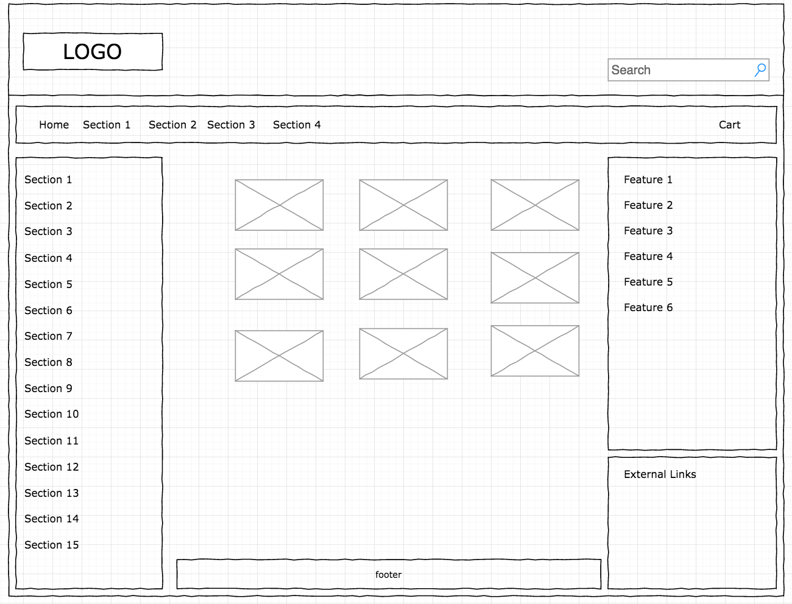

# Marketplace-POS(Project 2)

## About The Project 

The project about building a marketplace where user can add items to buy it. also, the the application is could be used as a point of sale software.
## Wireframe

## Technologies used
- React 
- React-Router
- Visual Studio Code 
- Browser Tools 
- React-bootstrap
- Reactstrap
- Material Ui
- Github
- Axios

## User Stories

- As a user, I should be able to add products to the cart
- As a user, I should be able to remove all the products in the cart 
- As a user, I should be increase the count of the product that is added to the cart 
- As a user, I should be decrease the count of the product that is added to the cart 
- As a user, I should  be able to select the product that is added to the cart 
- As a user, I should  be able to delete all selected products in the cart
- As a user, I should  be able to unselect the product that is added to the cart 
- As a user, I should be able to search for a product 
- As a user, I should  be able to switch between the home page and cart page
- As a user, I should be able to know the total count and price of each product and for all products in the cart

## Development Process
 First the application starts with getting date form axios. then the date is used to showcase each product name, price, and img. The application has many features such as add a product to cart, search for a product, delete all products in the cart, select and unselect a product in the cart, increase and decrease the count of each product in the cart, know the total count and price of each product and for all products in the cart. The application designs by using reactstrap, react-bootstap, and material UI

